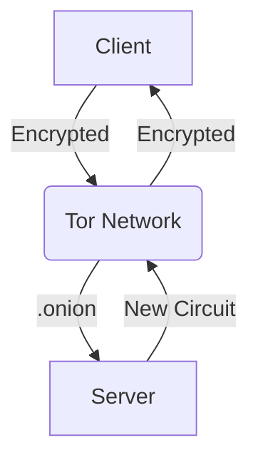

# Bimbi - Secure Tor-based Chat


Secure anonymous chat application operating over Tor network with end-to-end encryption.

## 🔐 Features

- **Complete anonymity** through Tor network
- **Military-grade encryption** (AES-256-CBC)
- **Automatic IP rotation** (configurable interval)
- **Hidden service** support (.onion addresses)
- **Cross-platform** (Windows/Linux/macOS)
- **No metadata collection** - true privacy

## ⚙️ Technical Specifications

| Component          | Technology Used               |
|--------------------|-------------------------------|
| Encryption         | AES-256-CBC with PKCS7 padding|
| Network Protocol   | SOCKS5 over Tor               |
| Control Protocol   | Tor Control Protocol          |
| Key Exchange      | Pre-shared key (PSK)          |
| Message Padding   | PKCS7                         |

## 🚀 Installation

### Prerequisites
- Python 3.8+
- Tor service running (default config)
- Crypto dependencies:

```bash
pip install -r requirements.txt
```

## Running the Server
```bash
python bimbi.py -mode server -k random -ip 300
```
- -k random generates new encryption key
- -ip 300 changes IP every 300 seconds (5 min)

## Running the Client
```bash
python bimbi.py -mode client -k KEY_HEX -server_ip SERVER.onion
```

## 🛡️ Security Architecture



- First Layer: Tor encryption
- Second Layer: AES-256 message encryption
- Third Layer: Key authentication handshake